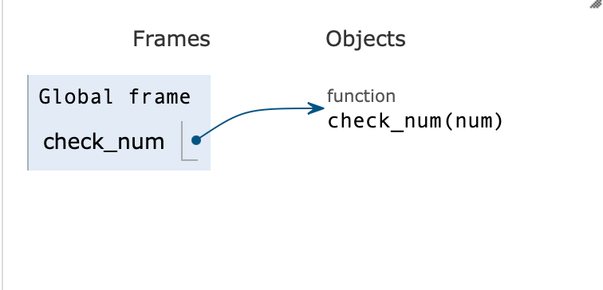
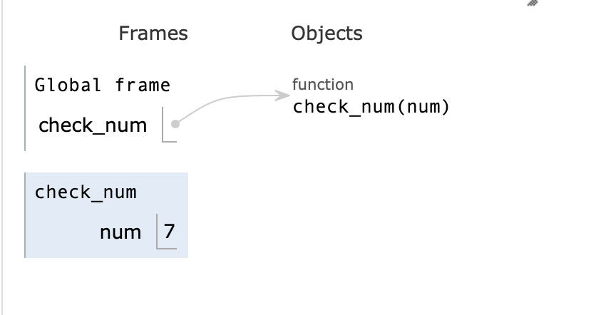
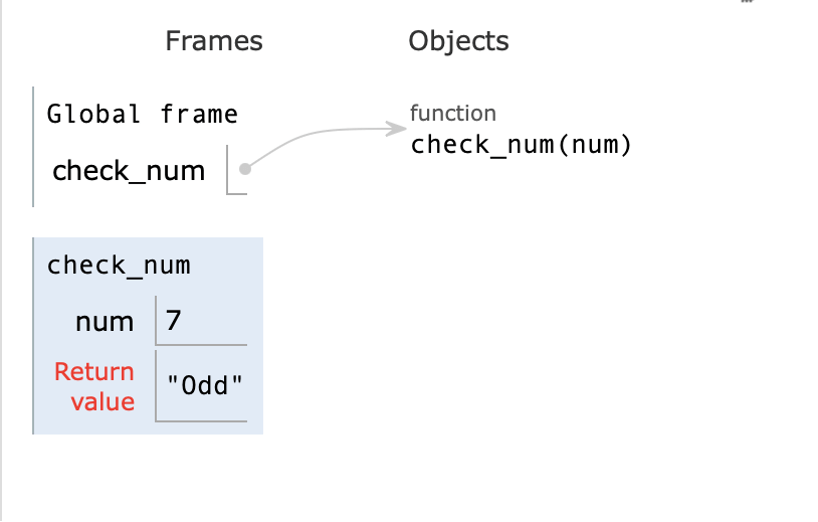
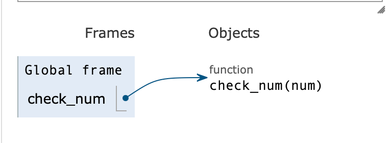
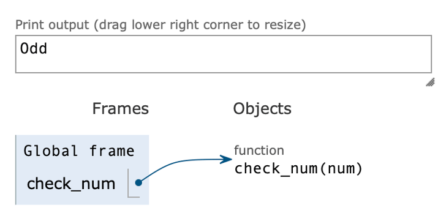

In this blog, I am going to walk you from the moment you call a function to when it finish its execution what actually happening under the hood. When I learned about this topic, I have made detailed notes to help myself understand this better, and now I’m excited to share my knowledge with you in this blog,

Let’s take an example of a function which returns whether a given number is **odd** or **even**.

```python
def check_num(num):
    """This function returns,
    whether a given number is odd or even"""

    if num % 2 == 0:
        return "Even"
    else:
        return "Odd"


print(check_num(7))
```

Now, let’s understand how above function gets executed in memory step by step,

## Step 1: Defining the Function

When python reads this line,

```python
def check_num(num):
```

Python doesn’t starts executing **check_num()** function yet, instead it store the function object in memory, just like saving a recipe for later use. At this point, Python knows there’s a function **check_num()** which takes a parameter **num**, but yet python doesn’t run the code written inside our function.

> Think of it as, installing an app in your mobile phone, when installed, an icon appears on your home screen. That icon is like **defining the function**, it’s ready to run, but the app only starts when you _click_ the app icon, just like **calling the function**.



## Step 2: Calling the Function

Now, python directly reach to last line,

```python
print(check_num(7))
```

Here, we are calling our function **check_num()**, passing **7** as an argument. When the function call happens, python creates a new **box** (separate memory block) for **check_num()** also know as **stack frame**.

Inside this stack frame, python stores the pass argument like this,



Now, the **check_num()** function code will be executed **independently** inside this created stack frame.

You might have question in you mind,

> 🤔 **Why does Python create an separate stack frame for a function, instead of just running it in global frame?**

Suppose your computer **RAM** as a **city** then,

- The **global frame** where your main program runs, **a house inside this city**.
- Then, every time when you call a function, python creates a separate **room inside the house** (stack frame).
- Now, this **room** has its **own variables**, separate from rest of house.

> **Note:** If we call more functions, then python will create more rooms, each with their own separate memory block (stack frame)

## Step 3: Executing the Function

Once the **check_num()** function is called, now python begins to executing inside code line by line inside the new created separate stack frame.

```python
if 7 % 2 == 0:
    return "Even"
else:
    return "Odd"
```

Since, **7% 2** not equal **to 0**, the condition becomes **false**. So python, skips to **else** block and **return** **'odd'** back to main program.



At this point, the **check_num()** finished executing and **returns** **'Odd'** to global frame, so python destroys the stack frame created for this function and also the local variables inside the frame, **num** deleted from the memory.



> ## Interview Questions

### 1. What's the lifespan of a function in memory?

**Answer:** A function becomes active in memory (stack frame) only during the time the function is called and until it returns a value. Outside of this period, the function does not exist in memory

### 2. What about variables inside a function?

**Answer:** Variables defined inside a function, like **num**, only exist during the function execution. Once the function execution finishes, these inside variables are automatically destroyed from memory.

## Step 4: Printing the Result

Finally, the **print(check_num(7))** statement becomes, **print('Odd')** and the output printed on the screen,



And, this is how your written function code gets executed in memory, from **definition**, to **call**, to **memory allocation**, to **execution** and finally **printing the result**.
